# Architecture

```mermaid
flowchart LR
    U[Browser: video + optional calibration] --> W[Same-origin HTTP]
    W --> N[AWS: Nginx / Lightning: frontend 5173 proxy]
    N --> A[FastAPI: one worker]
    A --> J[Bounded job manager]
    J --> V[FFprobe + FFmpeg orientation / CFR / resize]
    V --> C[Headless C++17 runner]
    C --> S[stella_vslam ORB tracking / mapping / loop correction]
    S --> E[Drain optimization / corrected Twc + landmarks]
    E --> R[CSV / PLY / JSON + timings]
    R --> B[React + Three.js WebGL]
```

The browser submits one multipart video and camera JSON. Admission occurs before parsing the upload; a job occupies a slot during upload and execution. Oversized requests are rejected, while actual FFprobe metadata decides media support. No filename becomes a storage path: the server assigns a UUID and stores an internal `input.video` filename.

FastAPI orchestrates external programs with argument arrays and a process-group boundary. FFmpeg resolves rotation and variable frame rate, then creates lossless FFV1 frames at bounded dimensions. This adds measurable decode/encode work; its latency must be benchmarked. The C++ runner reads that normalized CFR file and assigns timestamps from frame index/FPS, without playback sleeps. Keeping geometry changes in the shared preprocessing service prevents mismatched intrinsics between standalone, HTTP and provider deployments.

stella_vslam performs the SLAM algorithms. Local BA is allowed to complete when inserting keyframes; interruption of landmark generation and pre-BA interruption are disabled. The engine's feature-density control is `Preprocessing.min_size` (a minimum image area), not a fabricated `ORB_NUM_FEATURES` setting. `ORB_MIN_AREA` maps to that actual parameter. Its optimum remains unmeasured.

After feeding, a narrowly scoped engine hook waits for mapping, global detection/correction and loop BA. The worker then shuts down and exports poses from corrected reference keyframes. Retained unique loop edges are counted through the graph API. Multiple independent map roots fail the success criterion because concatenating unrelated coordinate gauges would be misleading. NaN/infinite and weak landmarks are excluded; no statistical metric-distance filtering assumes metres.

The web worker parses exports, checks quaternions/timestamps/counts and selects at most 10,000 display points deterministically. PLY keeps all valid exported points. Files are served through fixed artifact names, never arbitrary paths. Public status contains measured results and safe failure messages; detailed native logs remain in the temporary job directory.

## Process and storage lifecycle

One Uvicorn worker is essential: the admission manager is in memory, not shared between workers. Default active concurrency is one; no unbounded queue. The subprocess timeout and outer job deadline both terminate native child groups. Startup and every 30 seconds clean expired orphan/result folders. Videos are removed after success or failure; interruption by a machine kill can leave them until restart/TTL cleanup. Active uploads are not deleted by cleanup. At most ten completed/in-progress result records are retained; a newer request can evict the oldest completed result before its 30-minute TTL. Restart loses in-memory job lookup; users re-upload.

There is no account/authentication database. Random job IDs are bearer capabilities; do not share private result links. A public assessment endpoint can be occupied by other visitors despite its concurrency limit; put a vetted proxy rate limit in front if abuse is observed. This is an assessment-scale service, not a multi-tenant processing platform.

## Provider configuration

Only `aws` and `lightning` execution targets are accepted. `ENABLE_SLAM=true` is independently required. Python and native execution reject Windows/WSL. These explicit guards prevent accidental local runs; setting an environment string is not cryptographic proof of a cloud host, so operators must select the actual authorized host.

Lightning uses `scripts/cloud_backend.py` on port 8000 plus the compiled frontend server on 5173. Its same-origin proxy forwards `/api` internally. AWS uses the same API application inside Docker, with Nginx serving the same frontend and forwarding `/api`. All browser API paths remain relative. No vendor-specific SLAM implementation, model, GPU runtime, or cloud SDK exists in application code.
